# 作业说明
## 表名和字段
### 学生表
```
Student(s_id,s_name,s_birth,s_sex) 学生编号, 学生姓名, 出生年月, 学生性别
```
### 课程表
```
Course(c_id,c_name,t_id) 课程编号, 课程名称, 教师编号
```
### 教师表
```
Teacher(t_id,t_name) 教师编号, 教师姓名
```
### 成绩表
```
Score(s_id,c_id,s_score) 学生编号, 课程编号, 分数
```
## 创建表
### 学生表
```
DROP TABLE IF EXISTS `student`;
CREATE TABLE `student` (
`s_id` varchar(20),
`s_name` varchar(20),
`s_birth` varchar(20),
`s_sex` varchar(10)
)
row format delimited
fields terminated by ','
lines terminated by '\n';

load data local inpath '/root/data/student.csv' into table student;
```
### 课程表
```
DROP TABLE IF EXISTS `course`;
CREATE TABLE `course` (
  `c_id` varchar(20),
  `c_name` varchar(20),
  `t_id` varchar(20)
)
row format delimited
fields terminated by ','
lines terminated by '\n';

load data local inpath '/opt/install/data/course.csv' into table course;

```
### 教师表
```
DROP TABLE IF EXISTS `teacher`;
CREATE TABLE `teacher`(
`t_id` varchar(20),
`t_name` varchar(20)
)
row format delimited
fields terminated by ','
lines terminated by '\n';

load data local inpath '/opt/install/data/teacher.csv' into table teacher;

```
### 成绩表
```
DROP TABLE IF EXISTS `score`;
CREATE TABLE `score`(
`s_id` varchar(20),
`c_id` varchar(20),
`s_score` int
)
row format delimited
fields terminated by ','
lines terminated by '\n';

load data local inpath '/opt/install/data/score.csv' into table score;

```
## 作业
1. 查询"01"课程比"02"课程成绩高的学生的信息及课程分数<br/>
答：
```
select stu.s_id, stu.s_name, stu.s_birth, stu.s_sex, course_01, course_02 from (SELECT s_id,max( CASE c_id WHEN '01' THEN s_score ELSE 0 END ) course_01,max( CASE c_id WHEN '02' THEN s_score ELSE 0 END ) course_02 FROM score WHERE c_id IN ( '01', '02' ) GROUP BY s_id HAVING course_01 > course_02 AND count( s_id ) = 2) sc join student stu on sc.s_id = stu.s_id;
```
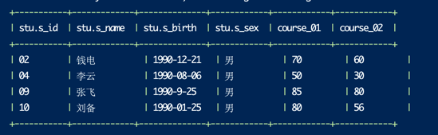

2. 查询"01"课程比"02"课程成绩低的学生的信息及课程分数<br/>
答：
```
select stu.s_id, stu.s_name, stu.s_birth, stu.s_sex, course_01, course_02 from (SELECT s_id,max( CASE c_id WHEN '01' THEN s_score ELSE 0 END ) course_01,max( CASE c_id WHEN '02' THEN s_score ELSE 0 END ) course_02 FROM score WHERE c_id IN ( '01', '02' ) GROUP BY s_id HAVING course_01 < course_02 AND count( s_id ) = 2) sc join student stu on sc.s_id = stu.s_id;
```
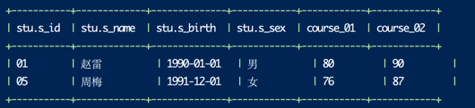

3. 查询平均成绩大于等于 60 分的同学的学生编号和学生姓名和平均成绩<br/>
答：
```
select stu.s_id, stu.s_name, sc.avg_score from (select s_id, avg(s_score) avg_score from score group by s_id having avg_score > 60) sc join student stu on sc.s_id = stu.s_id; 
```
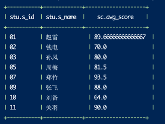

4. 查询平均成绩小于 60 分的同学的学生编号和学生姓名和平均成绩 (包括有成绩的和无成绩的)<br/>
答：
```
select t.s_id as s_id, t.s_name as s_name ,avg(t.s_score) as avg_score from (select stu.s_id as s_id, stu.s_name as s_name, sc.s_score as s_score from student stu left join score sc on stu.s_id = sc.s_id order by stu.s_id, sc.c_id) t group by t.s_id,t.s_name having avg_score < 60  or avg_score is null order by s_id;
```
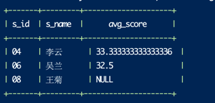

5. 查询所有同学的学生编号、学生姓名、选课总数、所有课程的总成绩<br/>
答：
```
select t.s_id as s_id, t.s_name as s_name, count(t.s_score) as course_cnt, sum(t.s_score) as score_sum from (select stu.s_id as s_id, stu.s_name as s_name, sc.s_score as s_score from student stu left join score sc on stu.s_id = sc.s_id ) t group by t.s_id, t.s_name;  
```
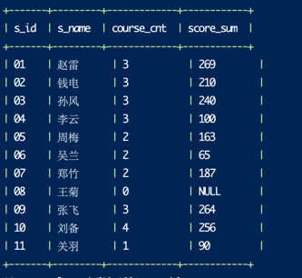

6. 查询 " 李 " 姓老师的数量<br/>
答：
```
select count(*) from teacher where t_name like '李%';
```


7. 查询学过"张三"老师授课的同学的信息<br/>
答：
```
select distinct stu.* from (select t_id from teacher where t_name = '张三') t join course c on t.t_id = c.t_id join score sc on c.c_id = sc.c_id join student stu on sc.s_id = stu.s_id;
```
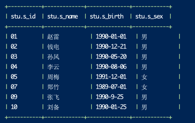

8. 查询没学过"张三"老师授课的同学的信息<br/>
答：
```
select * from student where s_id not in (select distinct sc.s_id from teacher t join course c on t.t_name = '张三' and t.t_id = c.t_id join score sc on c.c_id = sc.c_id);
```
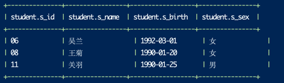
9. 查询学过编号为 "01" 并且也学过编号为 "02" 的课程的同学的信息<br/>
答：
```
select b.* from (select s_id from score where c_id in ('01','02') group by s_id having count(s_id) = 2) a join student b on a.s_id = b.s_id;
```
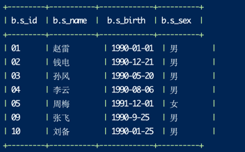
10. 查询学过编号为 "01" 但是没有学过编号为 "02" 的课程的同学的信息<br/>
答：
```
select stu.* from (select a.s_id as s_id from score a where a.c_id = '01' and not EXISTS (select b.s_id from score b where a.s_id = b.s_id and b.c_id = '02')) t join student stu on t.s_id = stu.s_id;
```
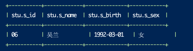

11. 查询没有学全所有课程的同学的信息<br/>
答：
```
select stu.s_id, stu.s_name, stu.s_birth, stu.s_sex from student stu left join score sc on stu.s_id = sc.s_id group by stu.s_id, stu.s_name, stu.s_birth, stu.s_sex having count(stu.s_id) < (select count(1) from course);
```
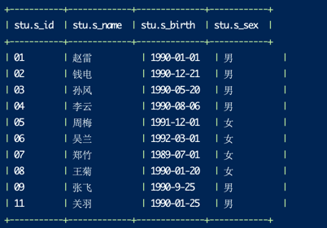

12. 查询至少有一门课与学号为 "01" 的同学所学相同的同学的信息<br/>
答：
```
select distinct stu.* from (select s_id from score  where c_id in (select c_id from score where s_id = '01') and s_id != '01' ) t join student stu on t.s_id = stu.s_id;
```
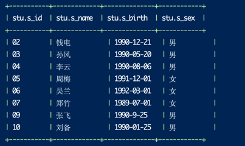
13. 查询和"01"号的同学学习的课程完全相同的其他同学的信息<br/>
    答：
```
select stu.* from (select b.s_id as s_id from (select c_id from score a where a.s_id = '01') a join score b on a.c_id = b.c_id and b.s_id != '01' group by b.s_id having count(b.s_id) = (select count(1) from score where s_id = '01')) t join student stu on t.s_id = stu.s_id;
```
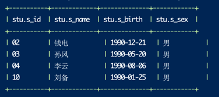
14. 查询没学过 " 张三 " 老师讲授的任一门课程的学生姓名<br/>
答：
```
select s_name from student where s_id not in (select distinct sc.s_id from teacher t join course c on t.t_name = '张三' and t.t_id = c.t_id join score sc on c.c_id = sc.c_id);
```
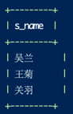

15. 查询两门及其以上不及格课程的同学的学号，姓名及其平均成绩<br/>
答：
```
select stu.*, t.s_score from (select s_id, avg(s_score) as s_score from score where s_score < 60 group by s_id having count(s_id) > 1) t join student stu on t.s_id = stu.s_id;
```
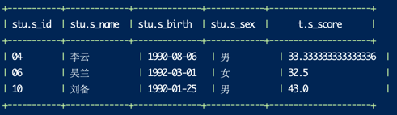